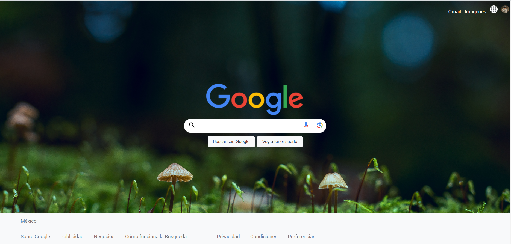

# Portafolio personal: Tecnolochicas PRO

Descripción de mi proyecto
Este proyecto fue creado durante el bootcamp Technolochicas PRO, es una página responsiva( adaptable a distintos dispositivos).

El próposito de la creación de este sitio web es hacer un clon de google lo mas similar posible, con los estilos, estructuras de la página principal del buscador del google, de acuerdo a lo aprendido en las semananas del bootcamp de Tecnolochicas PRO.

- Incluye recursos multimedia.

<a href="https://clondegoogleeee.netlify.app/" target="_blank">**Visitar clon de google** </a>

## Objetivos de aprendizaje

Dotar a las adolescentes con habilidades digitales y de empleabilidad, a través de enseñanza de programación (HTML, CSS, GitHub y JavaScript) y conocimiento para que inicien en el mundo profesional tecnológico.

## Tecnologías
El clon de google esta construido con:

- 

- 

© 2023 Dulce (Programa Technolochicas PRO)

